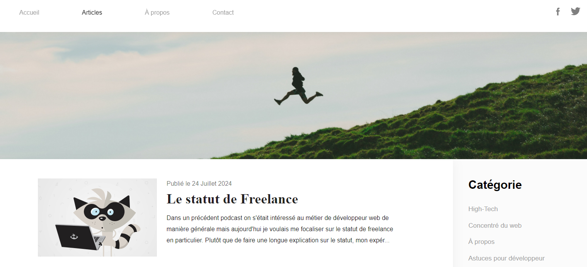

# :sunglasses: Projet | Blog

Ce projet à été réalisé dans le cadre d'une formation de <a href = 'https://grafikart.fr/tutoriels/tp-blog-css-1044' target = '_blank'>Grafikart</a> afin d'approfondir les bases du HTML et du CSS.

## Fonctionnalités

- **Page d'Accueil :** Présente un aperçu des articles du blog, chaque article comprenant une image, une date de publication, un titre et un extrait du contenu.
- **Page d'Articles :** Contient le contenu détaillé de chaque article avec un titre, une image et le texte complet.
- **Design Moderne :** Une mise en page élégante et moderne avec des sections bien définies.
- **Responsive :** Compatible avec différents appareils pour une expérience utilisateur optimale.

### Technologies Utilisées


#### Mon Projet

Ce projet fut le deuxième réalisé grâce à Grafikart. Il m'a permis d'approfondir les bases en HTML & CSS. J'ai laisser cours a ma fantasie pour l'améliorer.

##### Comment Exécuter le Projet Localement

1. Clonez ce référentiel sur votre machine locale :
   ```bash
   git clone https://github.com/votre-utilisateur/votre-repository.git
   ```
2. Accédez au dossier du projet :
   ```bash
   cd votre-repository
   ```
3. Ouvrez le fichier `index.html` dans votre navigateur pour voir le site.


